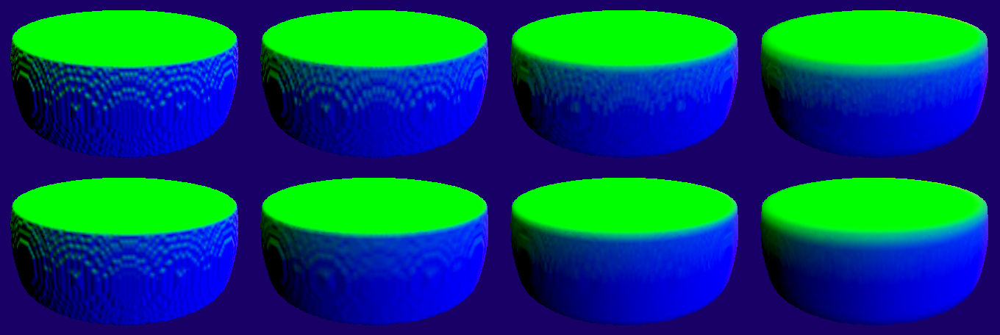

Distance Field Raytracer on SDL2 and OpenGL
===========================================

Check incredible stuff on rendering and modeling with implicit surfaces:
* http://graphics.cs.illinois.edu/papers/zeno (paper with the technique)
* https://www.youtube.com/watch?v=s8nFqwOho-s (how to create a scene with them)
* http://iquilezles.org/www/articles/raymarchingdf/raymarchingdf.htm

construction
------------

The distance function is created using a generator function of type is_gen (for
implicit surface).
df_build will then fill the grid f, of dimensions n, with fn(x,y,z).

```c
void df_build(df *o,
              ivec3 n, float *p,      // canvas / output buffer
              vec3 center, vec3 half, // AABB
              is_gen fn, void *arg);  // implicit surface generator
```

upload & draw
-------------

The program will then upload this distance-field grid into a OpenGL 3d texture.
For this we will draw a quad filling up the screen (the canvas), and the setup
the apropriate shaders.

The drawing process is a little diferent from a triangle rasterization method
since we define the geometry as a distance function. For each pixel we'll trace
a ray from the camera and try to hit the value 'zero' of the object (its
surface by definition).
```glsl

void main() {
	vec3 ro = (u_i_pvm_mat * vec4(f_ro, 1)).xyz; // ray origin in tex space
	vec3 rd = (u_t_pvm_mat * vec4(f_rd, 0)).xyz; // ray direction in tex space

	float d = trace(ro, rd, MAX_ITERATIONS, final_distance);
	if (final_distance <= EPSILON) { // found the object
		...
	}
}

float trace(vec3 ro, vec3 rd, int n, out float off) {
	float radius=0.0, d=0.0;
	for(int i=0; i<n; ++i, d += 1.02*radius) {
		vec3 s = ro + d * rd;
		radius = scene(ro+d*rd);
		if (radius < LIMIT) {
			break;
		}
	}
	off = radius;
	return d;
}
```

With this we have a very resonable 3d representation of the object, however for
lighing porposes we'll still need to reconstruct its normal for each pixel.


A drawing of the z-buffer / depth value.

diferent forms of normal calculation:
-------------------------------------

As mentioned above we want the normal. The simplest function for this has a
problem, the grid is very visible from it (as you can see below).

Below we use a diferent function and do a comparison with this one.

* X axis: epsilon in voxels.
* Y asis: diff method.


* from left to right epsilon in voxels: 0.25 | 0.5 | 1.0 | 2.0 | 4.0 | 8.0
* from top to bottom diff method: simple | sobel



* from left to right epsilon in voxels: 0.5 | 1.0 | 2.0 | 4.0
* from top to bottom diff method: simple | sobel

CSG operatinos
--------------

As you may have noticed, the objects above were not a sphere. They are a
"derivate" object constructed by combining primitives.

A reason to why use distance fields is that.

Let *a* and *b* be the distance fields of 2 objects somewhere in space (x,y,z).
The basic operations are as follows:

```c
float union(a,b)        = min(a, b);
float intersection(a,b) = max(a, b);
float subtraction(a,b)  = max(a,-b);
```

If you do this for each voxel of the grid, you will combine the two objects.
The above images are subtraction(box, sphere) and the union(box, sphere).

Follow the videos at
--------------------

https://www.youtube.com/playlist?list=PLucR9Mb5RnPMTDRqHdZI953NbLpUZIgSm
